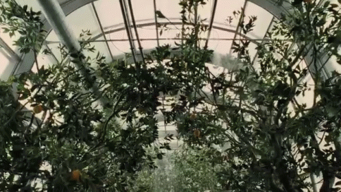
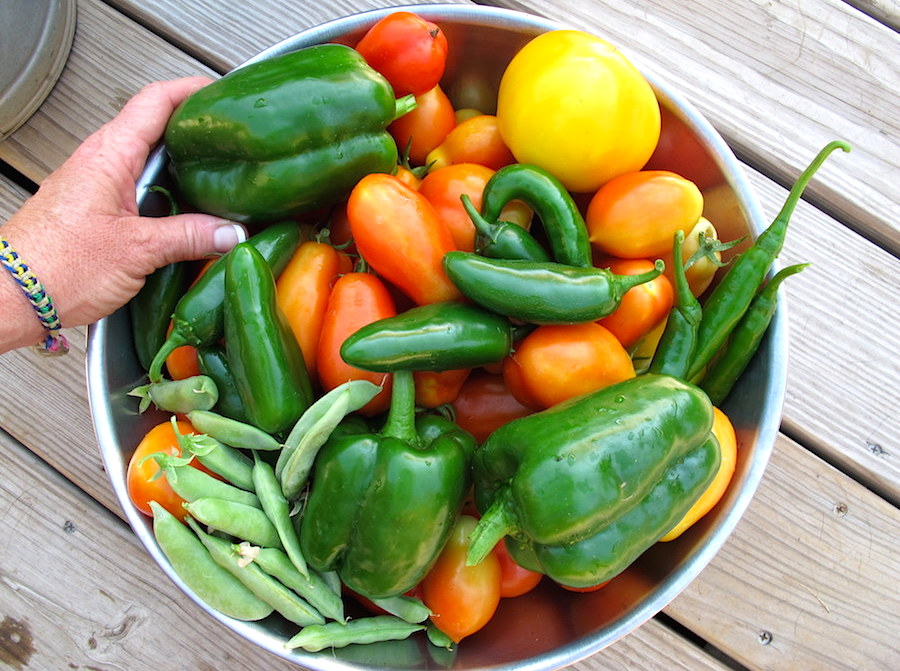
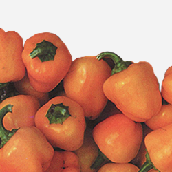

<!-- Header -->

  

    

      

        

          <h1>
            When everything becomes
          </h1>
          <h1>
            nothing and
          </h1>
          <h1>
            nothing everything
          </h1>
          <h1>
            What happens?
          </h1>
          <h3>Transform </h3>
          

          <ul class="list-inline intro-social-buttons">
            <li>
              <a href="/#pre-order" id="preorder-btn" class="btn btn-default btn-success btn-lg"><i class="fa"></i> Pre-Order Now</a>
            </li>
          </ul>
        

      

    

  

<!-- /.container -->

<!-- /.intro-header -->

<!-- Page Content -->

  

    

      

        

        <h2 class="section-heading">A vessel for love.</h2>
        <h3>Meet The Third Stone</h3>
        
Using cardboard, duck-tape, and plastic we make a kemtic dodecahedron.

        

        
        

        
Add your favorite seeds, water, and organic plant food. Plug it in and you're done -- Victory Garden will do the rest.

        

        <ul class="list-inline intro-social-buttons">
          <li>
          <a href="/#pre-order" id="preorder-btn" class="btn btn-default btn-success btn-lg"><i class="fa"></i> Pre-Order Now</a>
          </li>
        </ul>
      

      

        
      

    

<!-- /.container -->

<!-- /.content-section-a -->

  

    

      

        <h1>
           
        </h1>
        <h2>
           
        </h2>
      

      

        <h1>
           
        </h1>
        <h2>
           
        </h2>
      

      

        <h1>
           
        </h1>
        <h2>
           
        </h2>
      

    

  

  <!-- /.container -->

<!-- /.content-section-b -->

  

    

      

        

        

        <h2 class="section-heading">Stack Them</h2>
        
This template features the 'Lato' font, part of the <a target="_blank" href="http://www.google.com/fonts">Google Web Font library</a>, as well as <a target="_blank" href="http://fontawesome.io">icons from Font Awesome</a>.

      

      

        
      

    

  

  <!-- /.container -->

<!-- /.content-section-a -->

<!--       <ul class="social-list-small">
<li>
<g:plusone size="medium" href="<%= request.url %>"></g:plusone>
</li>
<li>
<a href="https://twitter.com/share" class="twitter-share-button" data-url="<%= request.url %>" data-text="I just signed up for this:">Tweet</a>
</li>
<li>

" data-send="false" data-layout="button_count" data-width="90" data-show-faces="false" data-font="arial">

</li>
</ul>

Success! Please check your inbox for a confirmation request.

Sorry, MailChimp couldn't validate your email. Try again?

<form action="/signup" class="form-inline">
<input id="email" name="email"  type="text" class="input-xlarge" placeholder="Email me about the project">
<button type="submit" class="btn btn-success">Subscribe</button>
</form> -->
<!-- Ouibounce Modal -->

  

  

    

      <h3>Before You Go</h3>
    

    

      

        <h1>Thanks for stopping by!</h1>
        <h2>Don't forget to get connected for updates.</h2>
      

      <form action="/signup" class="form-inline">
        <input id="email" name="email"  type="text" class="input-xlarge" placeholder="Keep me updated.">
        <button type="submit" class="btn btn-lg btn-success">Subscribe</button>
      </form>
    

    

      
no thanks

    

  

