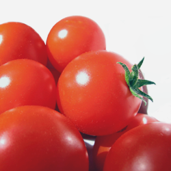

<!-- Header -->

  

    

      

        

          <h1>
            When everything becomes
          </h1>
          <h1>
            nothing and
          </h1>
          <h1>
            nothing everything
          </h1>
          <h1>
            What happens?
          </h1>
          <h3>Transform </h3>
          

          
          <ul class="list-inline intro-social-buttons">
            <li>
              <a href="/#pre-order" id="preorder-btn" class="btn btn-default btn-success btn-lg"><i class="fa"></i> Pre-Order Now</a>
            </li>
          </ul>
          
        

      

    

  

<!-- /.container -->

<!-- /.intro-header -->


<!-- Page Content -->

  

    

      

        

        <h2 class="section-heading">A vessel for love.</h2>
        <h3>Meet The Third Stone</h3>
        
Using cardboard, duck-tape, and plastic we make a kemtic dodecahedron.

        

        
        

        
Add your favorite seeds, water, and organic plant food. Plug it in and you're done -- Victory Garden will do the rest.

        

        <ul class="list-inline intro-social-buttons">
          <li>
          <a href="/#pre-order" id="preorder-btn" class="btn btn-default btn-success btn-lg"><i class="fa"></i> Pre-Order Now</a>
          </li>
        </ul>
      

      

        
      

    

<!-- /.container -->

<!-- /.content-section-a -->

  

    

      

        <h1>
           
        </h1>
        <h2>
           
        </h2>
      

      

        <h1>
           
        </h1>
        <h2>
           
        </h2>
      

      

        <h1>
           
        </h1>
        <h2>
           
        </h2>
      

    

  

  <!-- /.container -->

<!-- /.content-section-b -->

  

    

      

        

        

        <h2 class="section-heading">Stack Them</h2>
        
This template features the 'Lato' font, part of the <a target="_blank" href="http://www.google.com/fonts">Google Web Font library</a>, as well as <a target="_blank" href="http://fontawesome.io">icons from Font Awesome</a>.

      

      

        
      

    

  

  <!-- /.container -->

<!-- /.content-section-a -->
